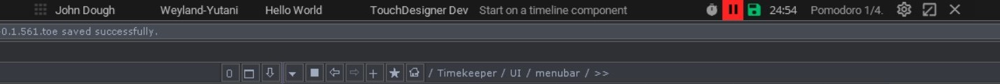
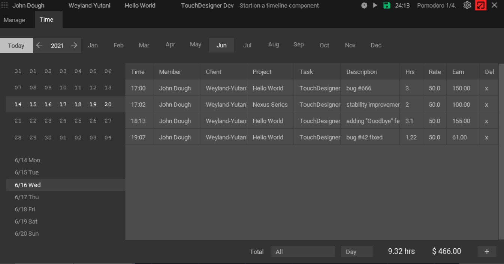

# :timer_clock: Timekeeper

## :hourglass: Work smarter, not harder. 

### Timekeeper is a lightweight and open source TouchDesigner application that doubles as a time tracker and wellness applet that lives quietly in your title bar. 
 
 

 
 
 

Instead of counting upwards to infinity like most time trackers, it counts down towards short and long rest intervals that are designed to increase your productivity and humanity.
 
 

 

Timekeeper encourages you to perform 25 minutes of work on a specified task, appended by 5 minutes of rest, for 4 sets at a time, with a 15 minute break in between each set of 4. It lives anywhere you want on your screen, with a minimal and unintrusive interface. It is specifically designed to reside in the white space of the Windows title bar of your favourite app.

#

## Usage

Built with TouchDesigner 2021.13610 on Windows 10 x64

#

## Changelog

0.1b - Initial release (beta)